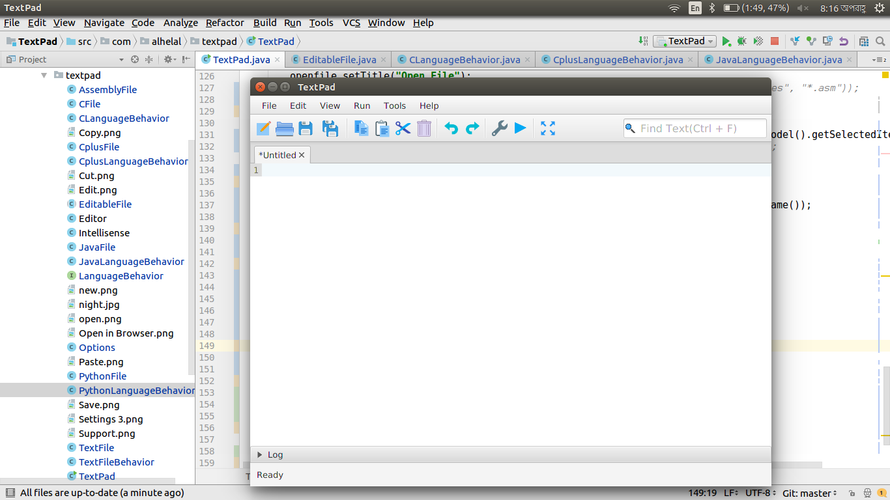

# TextPad
A text editor that predicts next word and provide code error suggestions.  
We are doing this project as our SDP lab project. We try to use Design pattern as many as possible to build the project. We have already used [Strategy Pattern](https://en.wikipedia.org/wiki/Strategy_pattern), [Singleton Pattern](), [Factory Pattern]() 

